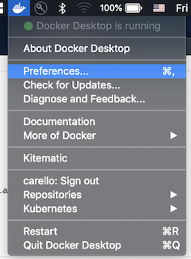
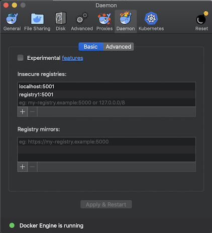

# CI/CD - Drone, Gogs and Minikube with Hyperkit and Local Registry

Docker-Compose is used to instantiate the environment and run locally. The GOGS container uses Sqlite3 and provides persistent storage for your repos. Minikube will use the Hyperkit driver and a local registry.

### Software Requirements
You'll need the following software:

*	[Docker for Desktop](https://docs.docker.com/docker-for-mac/install/#download-docker-for-mac)
* [Minikube](https://kubernetes.io/docs/tasks/tools/install-minikube/)
* [Kubectl](https://kubernetes.io/docs/tasks/tools/install-kubectl)
* Git. There are a couple of installation option/choices:
	* 	[Git using Homebrew](https://www.atlassian.com/git/tutorials/install-git)
	* [Git software installer](https://git-scm.com/downloads)
* [Drone CLI](https://docs.drone.io/cli/install/)
* You also have a [Docker Hub](docker.io) account.

	

## How to use
### Section 1: Bootstrapping

NOTE: If you already have a version of minikube installed, you can try to use that environment. However, I haven't tested it. This app is written for greenfield.

- Add registry to Docker:
	* Go to: Finder Tool bar, Docker menu, preferences:

	* >
	

	* Select the "Daemon" ICON, enter in the insecure registries:
		* `localhost:5001` and `registry1:5001`
		* Hit Apply & Restart

	* >

- Open a terminal:
	* clone this repo
	* `cd cicd-demo`
	* Enter `source ./drone-env.sh` to load the environmental variables.

- We are going to use the `k8-startup.sh` script. This script will start up minikube. However, it will delete any instance of minikube that you have. __Edit this file if you don't want to delete anything!__  The commands you might want to comment out are:

	* minikube delete
	* sudo rm -rf ~/.minikube
	* sudo rm -rf ~/.kub

	* When you're good to go, type: `./k8-startup.sh`. Answer the prompts as indicated.

- Enter `./drone-gogs-startup.sh` to start up Drone and Gogs.
- When the script is done, run `docker ps` and you should see containers: dc-gogs and dc-drone-server.
- Also, run: `docker network ls` and make sure you see a network named `cicd-demo_default`. 

### Section 2: Setting up DNSMASQ

- After minikube is installed, test external connectivity:
		
		minikube ssh
		ping google.com
		# We need to get the default gateway address
		ip route | grep default 
		# if the above command doesn't work try this:
		netstat -nr | grep default
				
	* If successful, go to:  __Section 3: Set up GOGS__ .  If not successful continue below.

- If failed we need to start or install dnsmasq. Lets check if dnsmasq is installed and the status, enter:
		
		brew services list

	* if not installed, go to: __Installing dnsmasq__ below.
		
		* If installed (the Status field can show started or stopped):
			* Edit the file: `/usr/local/etc/dnsmasq.conf` Add these lines at end of the file:
			
					address=/kube.local/<GW address from minikube>
					listen-address=1<GW address from minikube>
				
			* check the directory `ls /Libary/LaunchDaemons` Look for a file called: `homebrew.mxcl.dnsmasq.plist`
		* If the file is present, load the service:
					
				sudo launchctl load -w /Library/LaunchDaemons/homebrew.mxcl.dnsmasq.plist
					
		* If the file doesn't exist:
		
					sudo cp -v $(brew --prefix dnsmasq)/homebrew.mxcl.dnsmasq.plist /Library/LaunchDaemons
					sudo launchctl load -w /Library/LaunchDaemons/homebrew.mxcl.dnsmasq.plist

		* Test external connectivity:
	
				minikube ssh
				ping google.com
				netstat -r (copy gateway address from the netstat -r output)
		* If successful, go to:  __Section 3: Set up GOGS__  below.
			

- #### __Installing dnsmasq__
	* Run the follwowing:
	
			brew install dnsmasq
			sudo cp -v $(brew --prefix dnsmasq)/homebrew.mxcl.dnsmasq.plist /Library/LaunchDaemons
			
	* Edit the file: `/usr/local/etc/dnsmasq.conf` Add these lines at end of the file:
		
			address=/kube.local/<GW address from minikube>
			listen-address=<GW address from minikube>

	* Make sure its started by running: `brew services list`
		* If not running, type: `brew services start dnsmasq`
		* Check the directory `ls /Libary/LaunchDaemons` Look for a file called: `homebrew.mxcl.dnsmasq.plist`
		* If the file is present, start it; enter:
				
				sudo launchctl load -w /Library/LaunchDaemons/homebrew.mxcl.dnsmasq.plist
				
		* If the files doesn't appear in the /Libary/LaunchDaemons directory; enter:

				sudo cp -v $(brew --prefix dnsmasq)/homebrew.mxcl.dnsmasq.plist /Library/LaunchDaemons
				sudo launchctl load -w /Library/LaunchDaemons/homebrew.mxcl.dnsmasq.plist

	- Test external connectivty:
		
			minikube ssh
			ping google.com
	- At this point you should be ready to proceed, go to __Section 3: Set up GOGS__ next.

### Section 3: Set up GOGS

- Open a browser to `http://localhost:3000` (port 3000 is defined in the yaml file).
	* Use SQLite3
	* Set the Domain to: `dc-gogs`
	* SSH port: clear this field (blank).
	* Set 'Application URL' to: dc-gogs and port 3000 . ie,` http://dc-gogs:3000`
	* Create an admin user
	* Hit submit. Note that the browser might not refresh. Just open another browser to `http://localhost:3000` , login and create a repo called: `cicd-app`. You must name this exactly as indicated. 

- Go back to your terminal, type: `cd cicd-app` Enter:
	* `git init`
	* `git add .`
	* `git commit -m "My 1st commit"`
	* `git remote add origin http://localhost:3000/<repo-name>/cicd-app.git`
	* `git push -u origin master`
	* check your repo to make sure the files are present.

### Section 4: Set up DRONE

- Open another browser to `http://localhost`and enter your user info you created earlier in the Gogs setup. Wait for DRONE to sync. __Do not activate the repo yet__.

- We need to grab a few Drone environmental variables. Go to `User Settings` (upper right ICON) and copy the DRONE\_SERVER and DRONE\_TOKEN variables. It looks something like this:

		export DRONE_SERVER=http://localhost
		export DRONE_TOKEN=u4C5ghLKVTdafadjfldjfladfjaFDRs

- Go back to your open terminal and paste these in. Run `drone info` to check if things are working.

- We need to set up secret keys next. We'll be setting up 3 keys using these key words: KUBERNETES\_CERT,  KUBERNETES\_SERVER and KUBERNETES\_TOKEN. We'll be working from two different terminal windows, (you can work from a single terminal but the screen will get cluttered). You'll need the IP address of your computer. In your opened terminal, enter the following keys:

		drone secret add --name KUBERNETES_SERVER --allow-push-on-pull-request --repository <your repo you created in gogs> --data <IP of your computer:8001>
			
	>>_Example:_ drone secret add --name KUBERNETES_SERVER  --allow-push-on-pull-request --repository johnsmith/cicd-app --data 10.1.1.10:8001
	
	
- We need to copy the cert and token from K8's next. We'll capture the __cert__ first. Open another terminal window to work from and enter:
	
		kubectl get secret -n default  -o yaml | grep 'ca.crt:' | awk -F ": " '{ print $2 }' | pbcopy
	
	* The above command copied the __cert__ value to your clipboard
	* Go back to __your original terminal__ and type:
	
			drone secret add --name KUBERNETES_CERT --repository <the one you created in gogs> --data <paste from your clipboard>

	
- Next we'll capture the __token__. Go to the back to the terminal window where you have been running the kubectl commands and type:
		
		kubectl get secret -n default  -o yaml | grep 'token:' | awk -F ": " '{ print $2 }' | base64 --decode | pbcopy
		
	*  The above command copied the __decoded token__ value to your clipboard
	*  Go back to __your original terminal__ and type:
	
			drone secret add --name KUBERNETES_TOKEN  --repository <the one you created in gogs> --data <paste from your clipboard>

- Type: `drone secret ls <your repository>` and you should see 3 keys.

### Section 5: CICD in Action
	
- Go to your Drone browser window you opened earlier, tap the ICON on the upper left:

 	* Select `activate`
 	* Select `activate` again.
 	* In the next window, select the `Trusted` check box and hit `save`
 
- Go to your Gogs browser and into your repo, (you should already at this location).
- On the right hand side select the `settings` link.
- On the left hand side, select the tab for `webhooks`.
- You should then see a link in the center of the page for `http://dc-drone-server/hook`, select it, and scroll towards the bottom of the page; there is a button for `Test Delivery`. If things are correct you should make a successful connection, (scroll down the page to see the result).
* Go to your repository in Drone, click into the job run. Drone should start executing the job (if it hasn't already). If the job fails, it might of timed out. Just hit the 	`RESTART` button in Drone. Wait for the job to complete successfully.
* In your terminal window type:
	* `kubectl get pods` to check that the status is Running. It might take a few moments.
	* `minikube service cicd-app` A browser window should open with the html page of the demo.

### Section 6: Make some changes
- The demo is only designed to create new services. To make changes you'll need to delete the current deployment and services on K8s. First lets just take a look at what's been deployed on K8s, type: 
	* `kubectl get deployments`
	* `kubectl get services`

- We need to delete these; type these two commands: 
	* `kubectl delete service cicd-app`
	* `kubectl delete deployment cicd-app`

- In your terminal window, you should currently be in the cicd-app directory: `cd templates`
- There's an `index.html` file in there. Make some changes, add, commit, push to git and watch Drone kick off the job.
- In your terminal window type: `minikube service cicd-app`. A browser window should open with the html page of with your changes.

### Section 7: Clean up
To re-run this demo, we need to clean up things: shutdown and remove the containers, and delete the GOGS database. There's a script in the cicd-demo directory call `cleanup.sh` that you could use. __CAUTION! Please note this script isn't very robust so you might want to clean up things without using this script.__

You'll need to delete these files, if you decide to do this manually.

- Shut down and remove containers and delete the network: `dc-drone-server` and `dc-gogs`
	* `docker rm -f dc-drone-server`
	* `docker rm -f dc-gogs`
	* `docker network rm cicd-demo_default`
- In the `cicd-demo` directory, delete the `gogs` and `drone` directories.
	* `rm -rf <directory name>` 
- In the `cicd-app` directory, delete the hidden git directory :
	* `rm -rf .git`
- Minikube will be deleted when you re-run this demo. If you choose, you can delete it now, type: 
	* `minikube stop`
	* `minikube delete`
	* Optionally:
		* `sudo rm -rf ~/.minikube`
		* `sudo rm -rf ~/.kub` (this directory might not exist)
- Close any remaining terminal windows

### Troubleshooting
- Are all the containers in the same network?
	* `docker network inspect cicd-demo_default`
- Did you use the name 	`dc-gogs` when installing GOGS?
- Is the terminal window running `kubectl proxy --address='0.0.0.0' --disable-filter=true` still open? This was instantiated during the minikube install and needs to keep running.
- It's easy to make mistakes setting up the 5 keys. You might need to re-create them if you think that is the issue. You can remove the secret keys by typing: `drone secret rm --name <key name> --repository <repository name>`
- Look at the Drone build log and see which part of the build is failing.
- Did you load the environmental variables?
- Are you running the most recent versions of Minikube and Kubectl?

